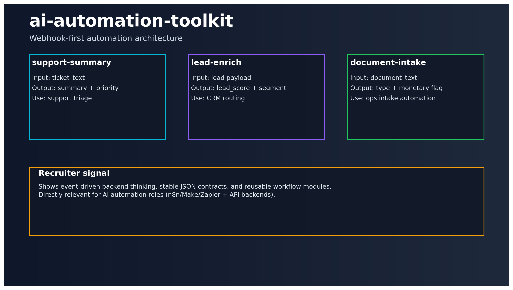

# 🤖 ai-automation-toolkit

[](https://github.com/keremercin/ai-automation-toolkit/actions/workflows/ci.yml)


Webhook-first automation backend for practical AI operations workflows.

## What this solves
Automation pipelines often break because event payloads are inconsistent and enrichment logic is scattered.

This toolkit provides clean, reusable JSON contracts for common automation use-cases.

---

## Product view



---

## Endpoints

- `GET /health`
- `GET /v1/workflows`
- `POST /v1/webhook/support-summary`
- `POST /v1/webhook/lead-enrich`
- `POST /v1/webhook/document-intake`

Swagger: `http://localhost:8200/docs`

---

## Quickstart

```bash
cp .env.example .env
python -m venv .venv
source .venv/bin/activate
pip install -e .[dev]

uvicorn automation_toolkit.api.main:app --reload --port 8200
```

---

## Workflow templates

1. **support-summary**
   - Input: support ticket text
   - Output: summary + priority

2. **lead-enrich**
   - Input: lead payload
   - Output: lead score + segment

3. **document-intake**
   - Input: document text
   - Output: document type + monetary terms flag

---

## Engineering quality

- tests + CI workflow
- clear endpoint contracts
- modular service layer for extension

---

## Docs

- Workflow details: `docs/WORKFLOWS.md`
- Case study: `docs/CASE_STUDY.md`

---

## Hiring signal

Shows event-driven backend mindset for AI automation roles:
**clean webhook APIs, reusable workflow logic, and production-friendly structure.**
